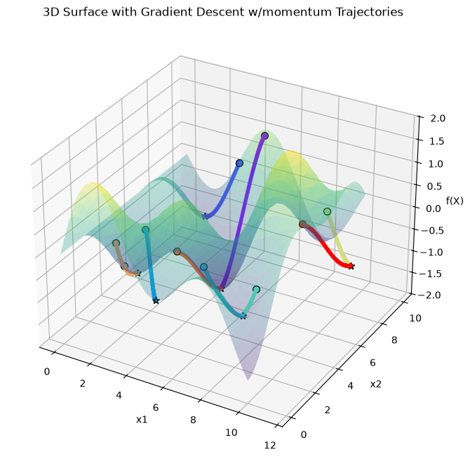

# Alice’s Adventures in a differentiable wonderland

My notes and excercices from this book.

- https://www.sscardapane.it/alice-book/

<p align="center">
  
</p>

## Usage

Run notebooks using [uv](https://docs.astral.sh/uv/):

```shell
uvx --python 3.12 jupyter lab
```

At the top of each notebook there's a cell with required dependencies, eg:

```
!uv pip install matplotlib
```
